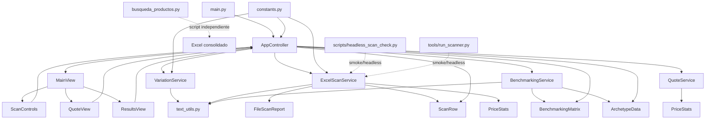

# Architecture

## 1. Propósito y Estado Actual

`01-escaneo-masivo-cotizaciones` es el módulo de escritorio de **Compipro 2.0** dedicado al escaneo masivo de archivos Excel históricos, la extracción de filas de cotización, la construcción de benchmarking por arquetipos y la cotización rápida con soporte de márgenes históricos.

El sistema está orientado a cargas grandes: cientos de archivos Excel y más de 14,000 filas crudas por corrida. La arquitectura actual prioriza tres objetivos operativos:

1. Mantener la UI fluida mientras se procesan lotes grandes.
2. Reducir el costo algorítmico en filtrado, normalización y benchmarking.
3. Conservar una separación MVC práctica, aunque con algunas responsabilidades de orquestación concentradas en el controlador.

## 2. Arquitectura General

La solución sigue un MVC pragmático apoyado por servicios de dominio.

- **Modelos**: encapsulan datos de negocio y resultados de procesamiento.
- **Servicios**: contienen la lógica pesada de escaneo, normalización, benchmarking, cotización y matching semántico.
- **Controlador**: orquesta el flujo entre UI, servicios, cancelación y exportación.
- **Vistas**: presentan datos y capturan eventos del usuario.

### Directorios principales

- `src/models/`: entidades y constantes.
- `src/services/`: motor de escaneo, benchmarking, variaciones, cotización y utilidades textuales.
- `src/controllers/`: coordinación del ciclo de vida de escaneo/benchmarking/exportación.
- `src/views/`: composición visual y renderizado de resultados.

## 3. Flujo de Ejecución

### 3.1 Arranque

1. `main.py` instancia `AppController`.
2. `AppController` construye servicios y vista principal.
3. `MainView` compone `ScanControls`, `QuoteView` y `ResultsView`.
4. La aplicación entra en `mainloop()`.

### 3.2 Escaneo masivo

1. El usuario define carpeta, categoría y keyword desde `ScanControls`.
2. `ScanControls` llama a `AppController.handle_scan(...)`.
3. El controlador limpia estado, deshabilita exportación, activa modo de escaneo y construye el `search_pack`.
4. `AppController` delega en `ExcelScanService.scan_folder(...)` mediante `ThreadPoolExecutor`.
5. `ExcelScanService` recorre archivos, detecta hojas válidas, lee encabezados y procesa filas.
6. La UI recibe progreso incremental con `after(0, ...)` para no bloquear el hilo principal.
7. Al terminar, `AppController._on_scan_done(...)` consolida filas, estadísticas y logs.

### 3.3 Benchmarking

1. `ScanControls` solicita benchmarking o cambio de categoría.
2. `AppController.handle_benchmarking(...)` filtra la última tanda de filas.
3. `BenchmarkingService.generar_benchmarking(...)` agrupa por arquetipo y tier.
4. `ResultsView` muestra la matriz como tabla de benchmarking.

### 3.4 Cotización rápida

1. `QuoteView` captura producto, cantidad y costo proveedor.
2. `AppController.handle_quote(...)` intenta resolver el arquetipo en benchmarking.
3. Si existe coincidencia, se aplica el margen del tier correspondiente.
4. Si no existe, se usa `QuoteService.create_quote(...)` con estadísticas acumuladas.

## 4. Auditoría MVC del Estado Actual

### 4.1 Modelos

Los modelos se mantienen limpios y sin dependencia de UI.

- `ScanRow`: representa una fila normalizada.
- `FileScanReport`: agrupa el resultado de un archivo.
- `PriceStats`: acumula márgenes por tier.
- `ArchetypeData`: consolida el benchmarking por arquetipo.
- `BenchmarkingMatrix`: agrupa la matriz de benchmarking y expone búsquedas normalizadas.

### 4.2 Servicios

La lógica de negocio vive correctamente fuera de la UI.

- `ExcelScanService`: lectura, filtrado, extracción y consolidación de filas.
- `VariationService`: categorías, tags, exclusiones y matching semántico.
- `BenchmarkingService`: agrupación por arquetipo y reglas de inferencia de márgenes.
- `QuoteService`: cálculo simple de cotización.
- `text_utils.py`: normalización y extracción textual.

### 4.3 Vistas

Las vistas siguen actuando como fachada visual y capturador de eventos.

- `MainView` expone métodos públicos para cambiar estado, limpiar resultados y actualizar la interfaz.
- `ScanControls` valida rutas y reenvía acciones al controlador.
- `QuoteView` valida entrada numérica y dispara la cotización.
- `ResultsView` renderiza tabla, KPIs y consola de logs.

### 4.4 Controlador

El controlador mantiene el rol de orquestador, pero concentra más trabajo del deseable para un MVC estricto:

- coordina hilos y cancelación,
- administra exportación de benchmarking,
- consolida resultados de escaneo,
- y arma parte del `search_pack` a partir de la taxonomía.

Esto es correcto para el producto actual, pero deja una zona gris en la frontera entre orquestación y lógica de dominio.

## 5. Optimización de Rendimiento

### 5.1 UI Chunking en `ResultsView`

La vista de resultados ya no inserta miles de filas de una sola vez.

- `ResultsView.add_rows(...)` carga una lista pendiente.
- `_render_next_row_batch()` inserta subconjuntos de filas de forma incremental.
- `_row_batch_size` controla el tamaño del lote y el reingreso al loop de eventos se hace con `after(1, ...)`.

Efecto operativo: el `mainloop` recupera control entre lotes y evita congelamientos al final de corridas grandes.

### 5.2 Vectorización y regex compilada en `ExcelScanService`

El motor de escaneo ahora evita trabajo repetitivo por fila donde es posible.

- `search_pack` se prepara una vez con `_prepare_search_pack(...)`.
- Los tags y exclusiones se convierten en patrones compilados.
- `_build_search_mask(...)` aplica el filtrado sobre `DataFrame` antes del loop de extracción.
- `_process_rows(...)` precalcula índices, columnas relevantes y ventanas de búsqueda.

Efecto operativo: menos costo de normalización repetida, menos búsqueda lineal por columna y mejor rendimiento en hojas grandes.

### 5.3 Caché de variaciones en `VariationService`

La taxonomía semántica ahora se reutiliza.

- `_get_category_pack(...)` construye y cachea tags, exclusiones y regex compiladas por categoría.
- `_cached_global_pack` evita reconstruir el paquete global.
- `_cached_all_variations` evita recalcular la lista plana de tags conocidos.

Efecto operativo: el filtrado de benchmarking y el reconocimiento de productos conocidos dejan de reconstruir la taxonomía en cada consulta.

### 5.4 Concurrencia y cancelación adaptativa

- `ExcelScanService.scan_folder(...)` usa `ThreadPoolExecutor` y espera incremental con `wait(..., timeout=0.2, return_when=FIRST_COMPLETED)`.
- `stop_event` actúa como señal de cancelación compartida.
- La exportación de depuración se ejecuta en un hilo daemon separado para no bloquear la UI.

Efecto operativo: la aplicación puede reportar progreso parcial y responder mejor al botón de cancelar, aunque la cancelación siga siendo cooperativa y no forzada.

## 6. Componentes y Responsabilidades

### `AppController`

Archivo: `src/controllers/app_controller.py`

Responsabilidad: coordinar la interacción entre UI y servicios.

Funciones relevantes:

- `handle_scan(...)`
- `handle_cancel()`
- `_on_scan_done(...)`
- `handle_quote(...)`
- `handle_benchmarking(...)`
- `_on_benchmarking_done(...)`
- `handle_export_benchmarking(...)`

### `ExcelScanService`

Archivo: `src/services/excel_scan_service.py`

Responsabilidad: leer Excels, detectar tablas y generar reportes.

Funciones relevantes:

- `scan_folder(...)`
- `scan_file(...)`
- `_prepare_search_pack(...)`
- `_build_search_mask(...)`
- `_process_rows(...)`
- `get_last_raw_scan_dataframe()`
- `export_raw_scan_dataframe(...)`

### `VariationService`

Archivo: `src/services/variation_service.py`

Responsabilidad: matching semántico y taxonomía de categorías.

Funciones relevantes:

- `get_categories()`
- `get_variations(...)`
- `get_global_search_pack()`
- `_get_category_pack(...)`
- `matches_category(...)`
- `is_known_product(...)`

### `BenchmarkingService`

Archivo: `src/services/benchmarking_service.py`

Responsabilidad: agrupar filas válidas y construir la matriz de benchmarking.

### `QuoteService`

Archivo: `src/services/quote_service.py`

Responsabilidad: cálculo de cotización simple.

### `ResultsView`

Archivo: `src/views/results_view.py`

Responsabilidad: renderizar KPIs, logs y filas por lotes.

### `ScanControls`

Archivo: `src/views/scan_controls.py`

Responsabilidad: capturar acciones del usuario y validarlas antes de delegar.

### `QuoteView`

Archivo: `src/views/quote_view.py`

Responsabilidad: formulario de cotización rápida.

### `Entities`

Archivo: `src/models/entities.py`

Responsabilidad: mantener los contenedores de datos del dominio.

## 7. Estado Real del MVC

La arquitectura en producción sigue siendo MVC, pero con una aplicación práctica y no purista.

Lo que está bien:

- Las vistas no contienen lógica pesada de escaneo ni benchmarking.
- Los modelos no conocen la UI.
- Los servicios encapsulan la lógica de negocio y de parsing.

Lo que conviene vigilar:

- El controlador todavía concentra exportación y parte del armado de búsqueda semántica.
- El render de la UI depende de callbacks `after(...)` desde varios puntos del flujo.
- El filtrado de benchmarking recorre `self._last_scan_rows` en memoria, lo cual es aceptable hoy, pero puede crecer en costo si el histórico en RAM aumenta.

## 8. Riesgos y Deuda Técnica

1. **Cancelación cooperativa, no determinista**: `stop_event` detiene nuevas unidades de trabajo, pero no garantiza aborto inmediato de tareas ya tomadas por un worker.
2. **Exportación en controlador**: la escritura de benchmarking sigue viviendo en `AppController`, lo que diluye SRP.
3. **Manejo amplio de excepciones**: aún hay `except Exception` defensivos que ocultan diagnóstico fino.
4. **Caminos legados**: existe código de búsqueda por fila que quedó desplazado por la vía vectorizada y puede simplificarse en una próxima limpieza.

## 9. Diagrama de Módulos

## 10. Resumen Ejecutivo

El módulo ha evolucionado hacia una variante MVC práctica, optimizada para cargas masivas y UI de escritorio. La arquitectura actual ya incorpora:

- render por lotes en la tabla,
- vectorización y regex compilada para búsquedas,
- caché de taxonomía por categoría,
- concurrencia cooperativa con `stop_event`,
- y separación razonable entre UI, dominio y procesamiento.

La principal deuda pendiente no es funcional, sino arquitectural: terminar de aislar exportaciones y endurecer el modelo de cancelación para que el control del ciclo de vida sea más claro y predecible.
